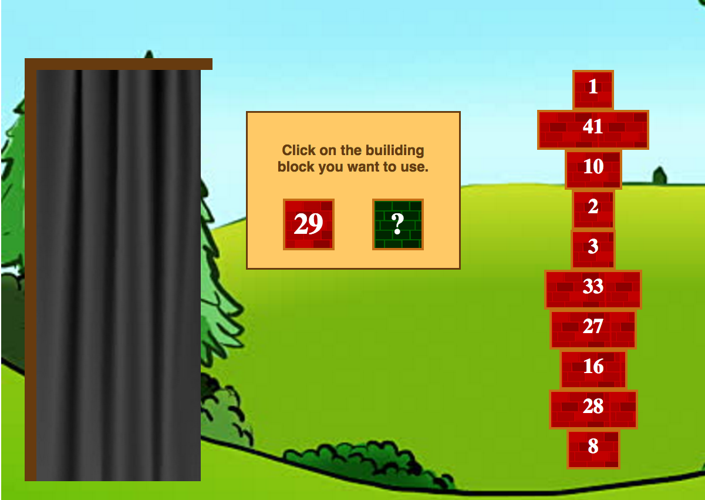

# TowerBlaster

## What is Tower Blaster?
A game where the goal is to sort your blocks faster than your opponent. 
The tower is finished sorted when all of the blocks are in ascending order, with the largest block at the bottom and the smallest on top.

## Why do we make it?
We wanted to have a multiplayer version of Tower Blaster, so we could play against eachother instead of the AI. :robot_face:
Aand we also love working and learning together, its our fun-time to use our creativity and skills on home projects.

## How do we work?

### Kake is the CEO - Chief Engineer Officer
  * his focus area is development, making all the important logic
  * he is also in control of all the server and database stuff
  * he must also always answer millus' git questions
  * play framework is his fellow companion in the battle of awesomeness

### Millus is the CDO - Chief Design Officer
  * her focus area is the CSS and HTML 
  * she also put some Javascript magic in when it is needed
  * aand of course she designs everything the game need, using her fav tool Sketch

## What did we learn?
To be continued :PpPppppPp

<3 <3 <3

